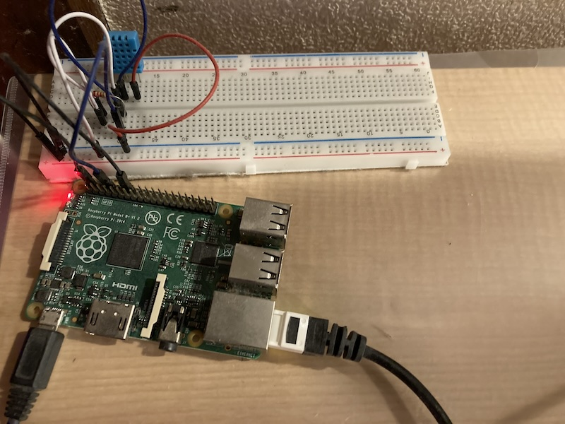

## 簡易セットアップ手順
本プログラムのセットアップ手順となります。
自分も忘れている箇所も多く、セットアップ手順自体が間違っている可能性があります。
各自で動作確認して頂きますようお願いいたします。

### 前提
・サーバーに既にLAMP環境はすでにインストールされている
・Raspberry PiのOSのインストールは済んでいる
・sshでRaspberry Piを外部から操作できる

### 必要なもの
・Raspberry Pi
・ブレッドボード
・ブレッドボードに接続するためのジャンパーピン
・温湿度計dht11
・LAMP環境を動かすためのレンタルサーバー等

### サーバー側のミドルウェアのバージョン
Linux:ディストリビュートは問いません
Apache > 2.4
MariaDB 10.*
PHP > 8.0

サーバー側のプログラムについて、10年以上前に練習用で作っていたものがベースとなっています。
そのためmysqliを使いDBに接続しているなど、古い箇所が多々あります。
動作しない場合など、皆さんの各種環境に合わせカスタマイズをお願いします。

### サーバー側のデータベースを用意する(PHP)
SQLクライアントソフトなどで、以下を実行してください。

#### データベースを用意する
> CREATE DATABASE ****;

#### テーブルを用意する
> CREATE TABLE `trn_temperature` (
`id` int(11) unsigned NOT NULL AUTO_INCREMENT,
`datetime` timestamp NULL DEFAULT current_timestamp() ON UPDATE current_timestamp(),
`temperature` double(3,1) DEFAULT NULL,
`humid` double(3,1) unsigned zerofill DEFAULT NULL,
PRIMARY KEY (`id`)
) ENGINE=InnoDB AUTO_INCREMENT=90897 DEFAULT CHARSET=utf8mb4;

#### serverフォルダー以下のファイル全てをサーバーにアップロード
#### DBの接続設定を行う
server/common_db/sql_queries.phpの以下の変数を、
MySQLの設定状況に応じて変更してください。

>public static $url = "****";  #接続先(localhostなど)
public static $user = "****";  #MySQLのユーザー名
public static $pass = "****";  #MySQLのパスワード
public static $db = "*****;    #MySQLのDB名
public static $tableName = "trn_temperature";  # 温度情報を格納するテーブル名

### dht11をRaspberry Piに接続する
温湿度計モジュールdht11をRaspberery Piに接続します。

接続の方法、ミドルウェアのインストール等は以下のQiitaを参考にしていただけると助かります。

[Raspberry PiとDHT11で温度・湿度を測る(Qiita)](https://qiita.com/mininobu/items/1ba0223af84be153b850)

上記のサイトにより、
・ブレッドボードにdht11を配線します。
・Python等でdht11から温湿度が取得できるか確認します。

### ファイルをRaspberry Piに配置する
scpなどを使い、 raspberry_pi/temp_dht11.py

### cronを設定する
Raspberry Pi側(raspberry_pi/temp_dht11.py)では、まずdht11より温度と湿度を取得します。
取得したデータをAPIによりサーバー側に送信します。

以下の例のように、crontabを使いtemp_dht11.pyを10分おきに実行します。
> */10 * * * * /usr/bin/python /**/dht11/temp_dht11.py
